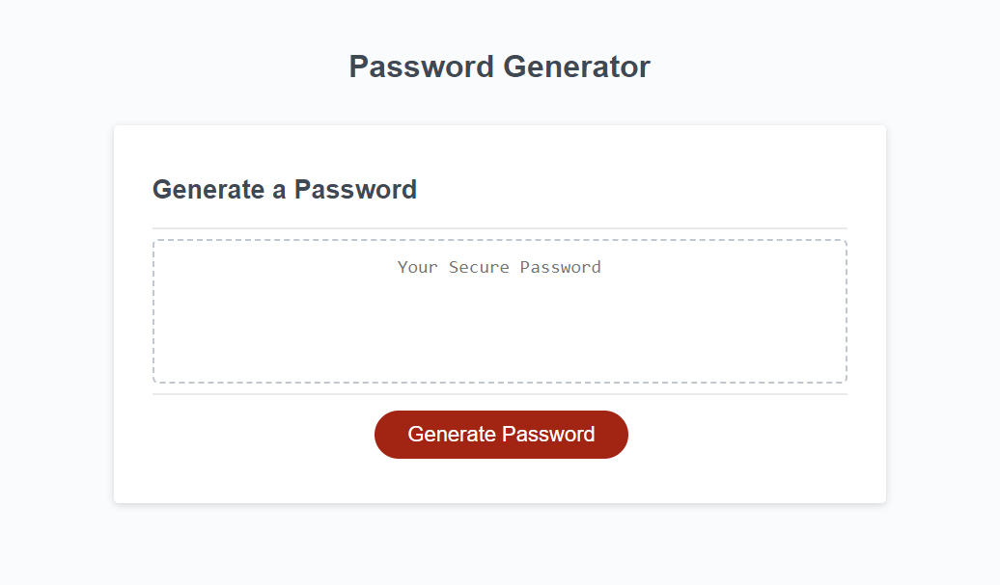

# peters-password-generator
This is a random password generator designed in the browser using javascript. It is used to create a random password between 8-128 characters while using specific criteria input by the user.

## Description
Live Page:
https://petechicchetti.github.io/peters-password-generator/

GitHub Repo:
https://github.com/PeteChicchetti/peters-password-generator

